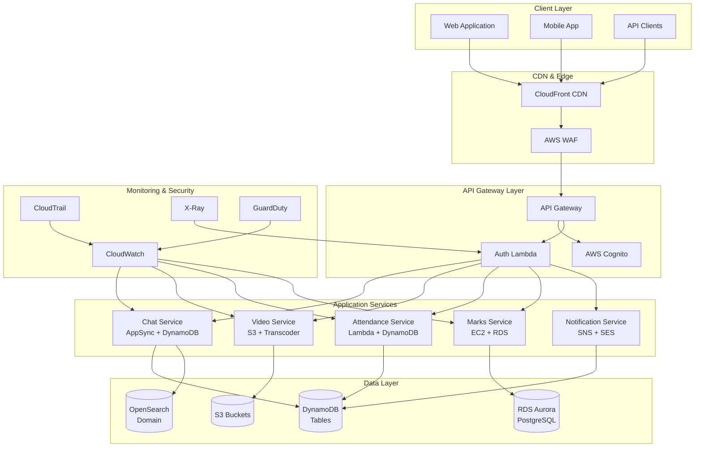
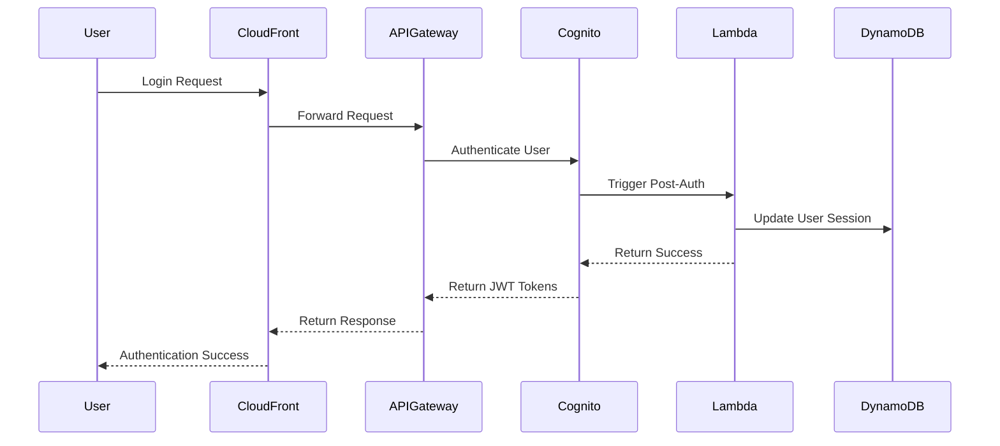
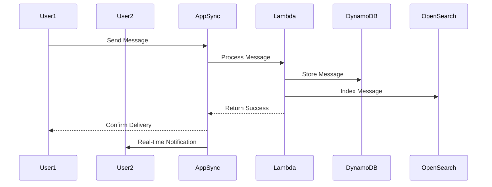
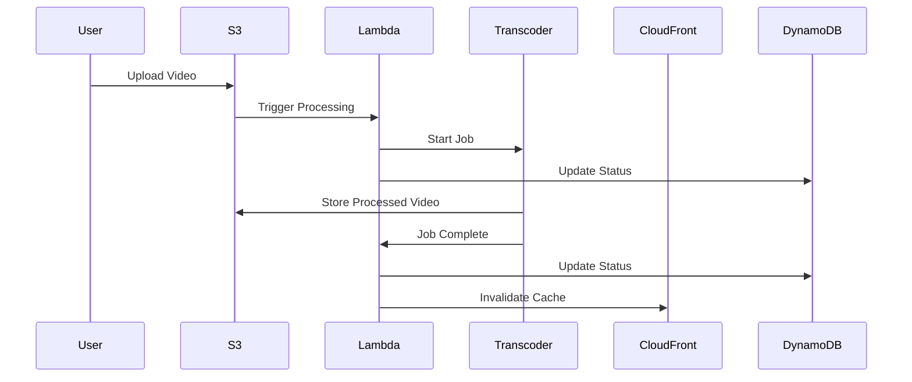

# AWS Education Platform - Architecture Documentation

## Overview

The AWS Education Platform is a comprehensive, cloud-native educational management system built on Amazon Web Services. It provides a scalable, secure, and feature-rich platform for educational institutions to manage courses, students, teachers, and educational content.

## Architecture Principles

### Cloud-Native Design
- **Serverless-First**: Leverages AWS Lambda, API Gateway, and managed services
- **Microservices Architecture**: Loosely coupled services with clear boundaries
- **Event-Driven**: Asynchronous communication using SNS, SQS, and EventBridge
- **Auto-Scaling**: Automatic scaling based on demand across all components

### Security by Design
- **Zero Trust Architecture**: Every request is authenticated and authorized
- **Defense in Depth**: Multiple layers of security controls
- **Encryption Everywhere**: Data encrypted at rest and in transit
- **Least Privilege**: Minimal required permissions for all components

### High Availability
- **Multi-AZ Deployment**: Resources distributed across availability zones
- **Fault Tolerance**: Graceful degradation and automatic recovery
- **Load Balancing**: Traffic distribution across multiple instances
- **Backup and Recovery**: Automated backups with point-in-time recovery

## System Architecture

## Component Architecture

### 1. Frontend Layer

#### Web Application (React)
- **Technology**: React 18 with TypeScript
- **Hosting**: S3 + CloudFront CDN
- **Features**:
  - Single Page Application (SPA)
  - Progressive Web App (PWA) capabilities
  - Responsive design for all devices
  - Real-time updates via WebSocket
  - Offline functionality with service workers

#### Mobile Application (Future)
- **Technology**: React Native or Flutter
- **Distribution**: App Store and Google Play
- **Features**:
  - Native mobile experience
  - Push notifications
  - Offline content access
  - Camera integration for attendance

### 2. API Gateway Layer

#### Amazon API Gateway
- **Type**: REST API with regional endpoints
- **Features**:
  - Request/response transformation
  - Rate limiting and throttling
  - CORS configuration
  - Request validation
  - Custom domain support

#### Authentication (AWS Cognito)
- **User Pool**: User management and authentication
- **Identity Pool**: AWS resource access
- **Features**:
  - Multi-factor authentication (MFA)
  - Social identity providers
  - Custom attributes
  - Lambda triggers for custom logic

### 3. Application Services

#### Chat Service (Real-time Messaging)
- **Technology**: AWS AppSync (GraphQL) + DynamoDB + OpenSearch
- **Features**:
  - Real-time messaging with subscriptions
  - Message search and history
  - File attachments
  - User presence tracking
  - Typing indicators
  - Room management

#### Video Service (Lecture Streaming)
- **Technology**: S3 + Elastic Transcoder + CloudFront
- **Features**:
  - Video upload and processing
  - Multiple quality transcoding
  - Adaptive bitrate streaming
  - Thumbnail generation
  - Progress tracking
  - Secure video delivery

#### Attendance Service (Tracking)
- **Technology**: Lambda + DynamoDB + API Gateway
- **Features**:
  - QR code-based check-in
  - Geolocation validation
  - Attendance analytics
  - Automated reporting
  - Integration with course schedules

#### Marks Service (Grade Management)
- **Technology**: EC2 + RDS Aurora + Application Load Balancer
- **Features**:
  - Grade calculation and management
  - Assignment tracking
  - Performance analytics
  - Bulk operations
  - Export capabilities

#### Notification Service (Communications)
- **Technology**: SNS + SES + Lambda
- **Features**:
  - Multi-channel notifications (email, SMS, push)
  - Template-based messaging
  - User preferences
  - Delivery tracking
  - Bounce handling

### 4. Data Layer

#### Amazon RDS Aurora PostgreSQL
- **Purpose**: Relational data (grades, courses, users)
- **Features**:
  - Multi-AZ deployment
  - Read replicas
  - Automated backups
  - Performance Insights
  - Encryption at rest

#### Amazon DynamoDB
- **Purpose**: NoSQL data (chat messages, attendance, notifications)
- **Features**:
  - Auto-scaling
  - Global secondary indexes
  - DynamoDB Streams
  - Point-in-time recovery
  - Encryption at rest

#### Amazon S3
- **Purpose**: Object storage (videos, files, static assets)
- **Features**:
  - Versioning
  - Lifecycle policies
  - Cross-region replication
  - Server-side encryption
  - Access logging

#### Amazon OpenSearch
- **Purpose**: Search and analytics (message search, logs)
- **Features**:
  - Full-text search
  - Real-time indexing
  - Kibana dashboards
  - Security plugins
  - Cluster scaling

### 5. Security Layer

#### AWS WAF (Web Application Firewall)
- **Protection**: SQL injection, XSS, DDoS
- **Rules**: Rate limiting, geo-blocking, IP filtering
- **Integration**: CloudFront and Application Load Balancer

#### AWS GuardDuty (Threat Detection)
- **Monitoring**: Malicious activity and unauthorized behavior
- **Intelligence**: AWS threat intelligence feeds
- **Integration**: CloudWatch Events for automated response

#### AWS Config (Compliance Monitoring)
- **Tracking**: Resource configuration changes
- **Rules**: Compliance validation
- **Remediation**: Automated compliance enforcement

### 6. Monitoring Layer

#### Amazon CloudWatch
- **Metrics**: Application and infrastructure monitoring
- **Logs**: Centralized log aggregation
- **Alarms**: Proactive alerting
- **Dashboards**: Real-time visualization

#### AWS CloudTrail
- **Auditing**: API call logging
- **Compliance**: Regulatory compliance support
- **Security**: Unauthorized access detection

#### AWS X-Ray
- **Tracing**: Distributed request tracing
- **Performance**: Latency analysis
- **Debugging**: Error root cause analysis

## Data Flow Architecture

### 1. User Authentication Flow

### 2. Real-time Chat Flow

### 3. Video Processing Flow

## Scalability Architecture

### Horizontal Scaling
- **Lambda Functions**: Automatic scaling based on request volume
- **DynamoDB**: On-demand scaling for read/write capacity
- **RDS Aurora**: Read replicas for read scaling
- **EC2 Auto Scaling**: Automatic instance scaling based on metrics

### Vertical Scaling
- **RDS Instance Classes**: Upgrade to larger instances as needed
- **Lambda Memory**: Configurable memory allocation
- **OpenSearch Instances**: Scale instance types for performance

### Global Scaling
- **CloudFront**: Global edge locations for content delivery
- **Multi-Region**: Disaster recovery and global presence
- **Cross-Region Replication**: Data replication for availability

## Security Architecture

### Network Security
- **VPC**: Isolated network environment
- **Security Groups**: Instance-level firewalls
- **NACLs**: Subnet-level access control
- **Private Subnets**: Database and application isolation

### Identity and Access Management
- **IAM Roles**: Service-to-service authentication
- **Cognito**: User authentication and authorization
- **Resource Policies**: Fine-grained access control
- **Cross-Account Access**: Secure multi-account setup

### Data Protection
- **Encryption at Rest**: KMS encryption for all data stores
- **Encryption in Transit**: TLS/SSL for all communications
- **Key Management**: Centralized key management with KMS
- **Data Classification**: Sensitive data identification and protection

### Application Security
- **Input Validation**: Comprehensive input sanitization
- **Output Encoding**: XSS prevention
- **SQL Injection Prevention**: Parameterized queries
- **CSRF Protection**: Cross-site request forgery prevention

## Performance Architecture

### Caching Strategy
- **CloudFront**: Global CDN for static content
- **Application Caching**: In-memory caching for frequently accessed data
- **Database Caching**: Query result caching
- **API Response Caching**: API Gateway response caching

### Database Optimization
- **Indexing Strategy**: Optimized database indexes
- **Query Optimization**: Efficient query patterns
- **Connection Pooling**: Database connection management
- **Read Replicas**: Read workload distribution

### Content Delivery
- **CDN**: Global content distribution
- **Image Optimization**: Automatic image compression
- **Video Streaming**: Adaptive bitrate streaming
- **Static Asset Optimization**: Minification and compression

## Disaster Recovery Architecture

### Backup Strategy
- **Automated Backups**: Daily automated backups for all data stores
- **Point-in-Time Recovery**: Granular recovery capabilities
- **Cross-Region Backup**: Backup replication to secondary regions
- **Backup Testing**: Regular backup restoration testing

### High Availability
- **Multi-AZ Deployment**: Resources across multiple availability zones
- **Auto Failover**: Automatic failover for critical components
- **Load Balancing**: Traffic distribution for availability
- **Health Checks**: Continuous health monitoring

### Recovery Procedures
- **RTO (Recovery Time Objective)**: 4 hours for full system recovery
- **RPO (Recovery Point Objective)**: 1 hour maximum data loss
- **Runbook**: Detailed disaster recovery procedures
- **Testing**: Regular disaster recovery testing

## Cost Optimization Architecture

### Resource Optimization
- **Right-Sizing**: Appropriate resource sizing for workloads
- **Reserved Instances**: Cost savings for predictable workloads
- **Spot Instances**: Cost-effective compute for batch processing
- **Lifecycle Policies**: Automated data archival and deletion

### Monitoring and Alerting
- **Cost Monitoring**: Real-time cost tracking
- **Budget Alerts**: Proactive cost notifications
- **Usage Analytics**: Resource utilization analysis
- **Optimization Recommendations**: Automated cost optimization suggestions

### Environment Management
- **Development Optimization**: Smaller resources for non-production
- **Scheduled Scaling**: Automatic scaling based on usage patterns
- **Resource Tagging**: Cost allocation and tracking
- **Cleanup Automation**: Automatic cleanup of unused resources

## Integration Architecture

### External Integrations
- **LMS Integration**: Learning Management System connectivity
- **SIS Integration**: Student Information System integration
- **SSO Integration**: Single Sign-On with institutional systems
- **Payment Gateway**: Integration with payment processors

### API Design
- **RESTful APIs**: Standard REST API design patterns
- **GraphQL**: Flexible query language for complex data
- **Webhook Support**: Event-driven integrations
- **Rate Limiting**: API usage control and protection

### Data Exchange
- **Standard Formats**: JSON, XML, CSV data exchange
- **Real-time Sync**: Live data synchronization
- **Batch Processing**: Bulk data import/export
- **Data Validation**: Comprehensive data validation

## Future Architecture Considerations

### Emerging Technologies
- **AI/ML Integration**: Machine learning for personalized learning
- **IoT Integration**: Internet of Things for smart classrooms
- **Blockchain**: Credential verification and certification
- **AR/VR**: Augmented and virtual reality learning experiences

### Scalability Enhancements
- **Microservices**: Further decomposition into microservices
- **Container Orchestration**: Kubernetes for container management
- **Event Sourcing**: Event-driven architecture patterns
- **CQRS**: Command Query Responsibility Segregation

### Global Expansion
- **Multi-Region Deployment**: Global presence for international users
- **Localization**: Multi-language and cultural adaptation
- **Compliance**: Regional compliance requirements (GDPR, etc.)
- **Performance Optimization**: Regional performance optimization

This architecture provides a solid foundation for a scalable, secure, and maintainable education platform that can grow with institutional needs while maintaining high performance and availability.